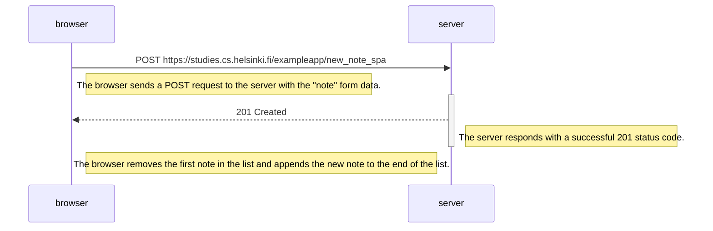

```mermaid
sequenceDiagram
    participant browser
    participant server
    browser ->> server: POST https://studies.cs.helsinki.fi/exampleapp/new_note_spa
    Note right of browser: The browser sends a POST request to the server with the "note" form data.
    activate server
    server -->> browser: 201 Created
    Note right of server: The server responds with a successful 201 status code.
    deactivate server
    Note right of browser: The browser removes the first note in the list and appends the new note to the end of the list.
```